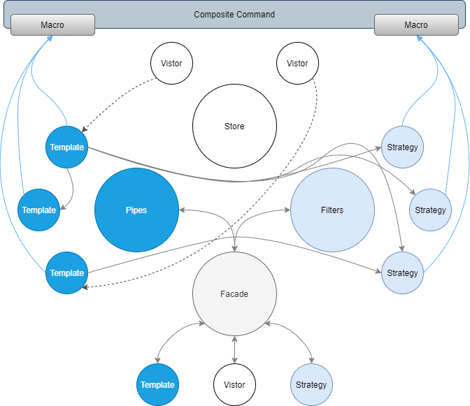

# Dataflow implement by Design Pattern

## Pipes & Filters application

+ Singleton Pattern
    - Facade Pattern
+ Flyweight Pattern
    - Command Pattern
    - Composite pattern

## Pipes

+ Template method Pattern
+ Chain of Responsibility Pattern

## Filters

+ Strategy Pattern

## Store

+ Vistor Pattern
+ Injection Dependency
